# Overview of Stop Snoring devices

## Contents  
- [Introduction](#Introduction)  
- [Experiment](#Experiment)  
- [Data analysis and Conclusion](#Data-analysis-and-Conclusion)
- [Feedback](#Feedback)   
- [Team](#Team) 
- [Copyright](#Copyright)

## Introduction

In this Clinical Applications of Computational Medicine Group Project, we have chosen a topic about sleep problems such as snoring and lack of sleep. It focuses on how to choose the right device to relieve such symptoms. There are many friends around us who have sleep problems. Our relatives and friends, and even ourselves, often suffer from symptoms such as snoring and difficulty breathing when sleeping. These symptoms can cause problems for themselves and their partners. Common symptoms of people with sleep disorders include snoring, headaches, trouble sleeping and concentrating, and in severe cases, death. Most people don’t know how to properly relieve these symptoms and how to choose the right equipment to improve their sleep.Our goals are to help patients determine the severity of their disease. Assist them to choose the device that suits them best. Perform analysis and evaluation of representative devices on the market.

## Experiment

In order to achieve a certain accuracy and obtain certain reliable data, we selected five different devices and asked friends and patients to classify and test the effects of different devices as shown Figure 1.  
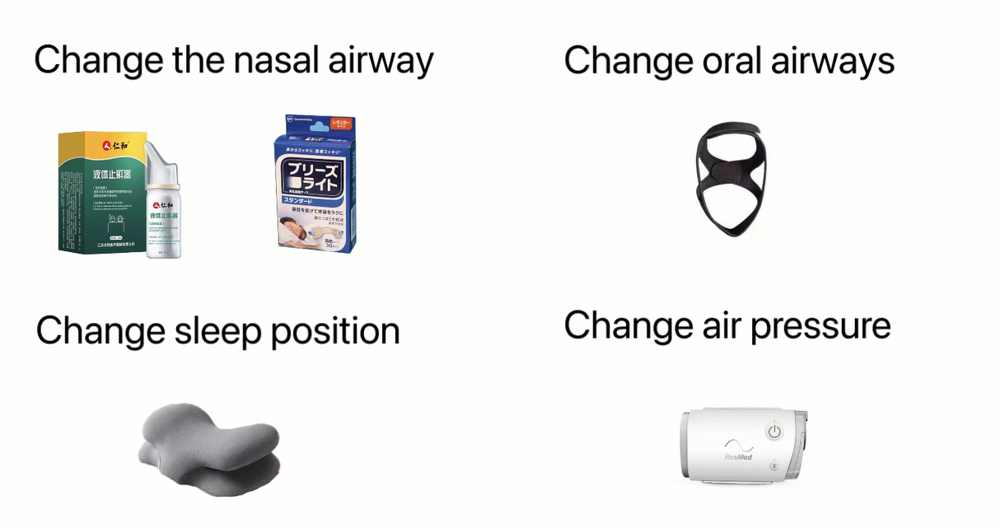  
[Figure 1]  
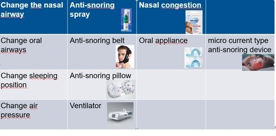  
Constrained by this condition, we set out to measure changes in sleep quality.
We are based on five different devices: nasal strips, corrective tapes, nasal sprays, anti-snoring patches and ventilators. The subjects were divided into five groups to test the data. The subjects wore different equipment, and the snail sleep software, as shown Figure 2.

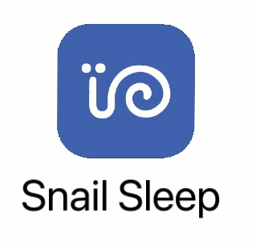  
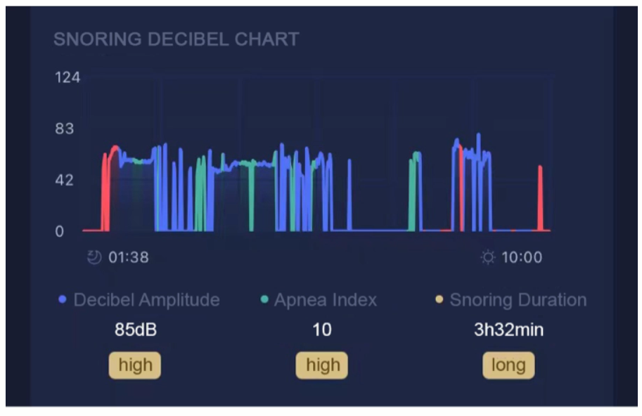  
[Figure 2 Interface of the snail sleep software]      

It can be used to record the subjects’ sleep time, blockage time, and blockage times. The test duration was set to seven days, regardless of the subjects’ age, height, weight and gender, and certain data was obtained.
After referring to some biological and clinical evaluation of medical devices, we developed our Evaluation Standard shown Figure 3.  
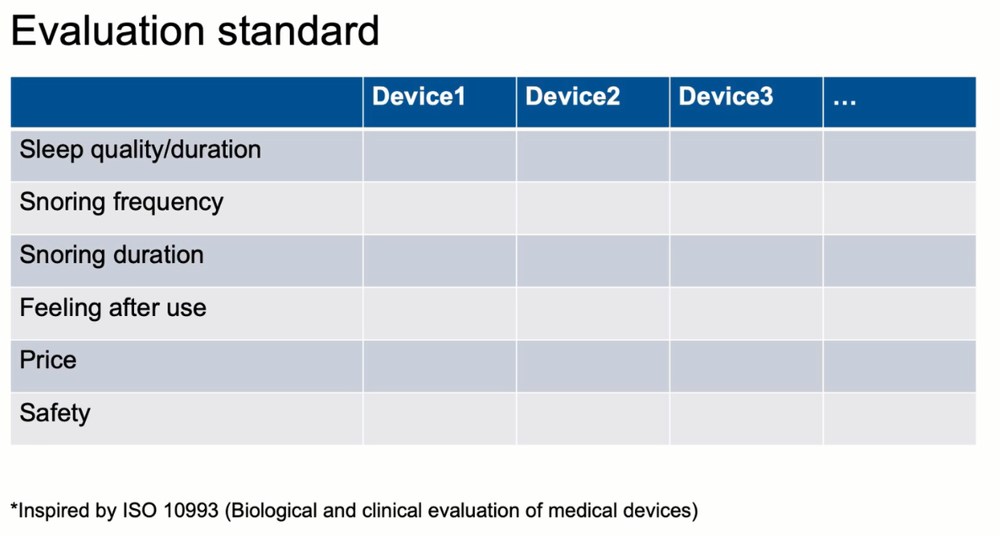    
[Figure 3]  

## Data analysis and Conclusion

We show the data measured by the Snail APP over the test date and display the data control group by different devices. As shown in Figure 2, we can see that the testers’ sleep duration increased to a certain extent after wearing or using the device. Among them, Face Band and Nose Sticker have the most obvious improvement.  

In Figure 4, we can see that each device has a certain effect in reducing the number of patients snoring. Among them, ventilators and Anti-Snoring pillows are the most obvious. But it’s worth noting that the Face Band doesn’t perform as well in terms of snoring frequency. It is possible that the testers had inadvertently loosened the headgear due to pressure on the subject’s head during the night.  

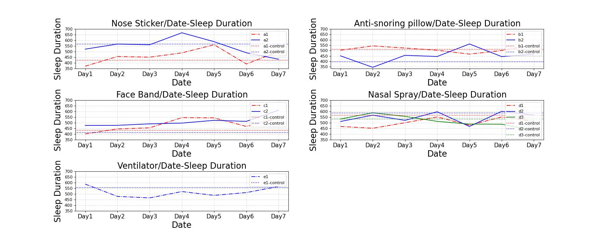    
[Figure 4] 

In Figure 5, we can see that each device has a significant effect on the reduction of snoring duration. Among them, the ventilator is the most prominent.   

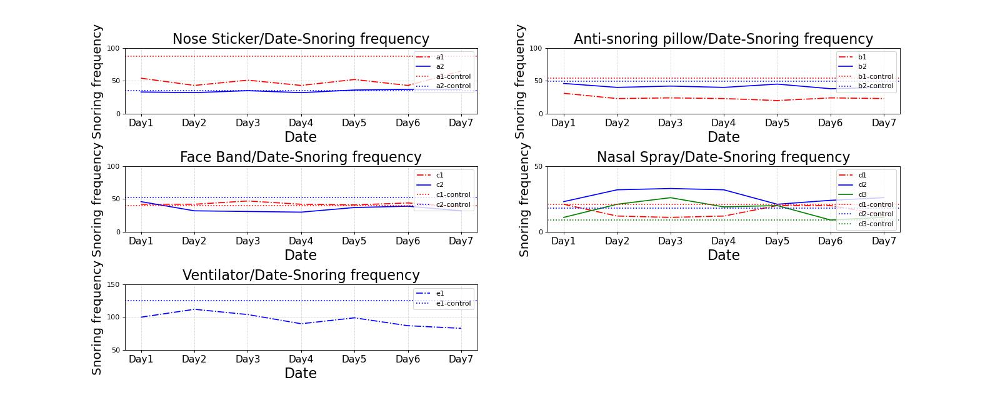    
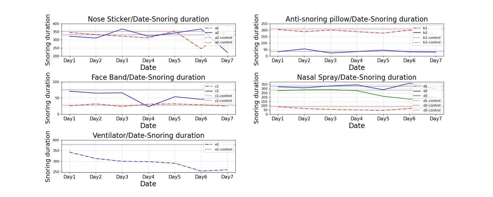    
[Figure 5]

We quantified the tester’s feedback every night and fitted it into a line graph over time, as shown in Figure 6.   

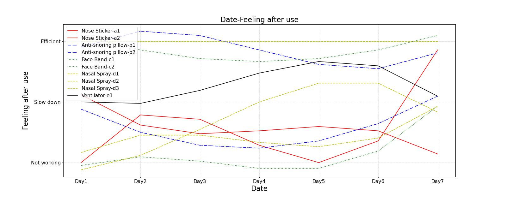    
[Figure 6]

Due to the small sample size, we attempted to find the performance of the device from tester evaluations of different degrees of disease. It can be seen that the overall evaluation of the Nose Sticker is low, which may be due to the unpleasant feeling of the testers caused by the pulling of the nasal cavity when wearing it. For the three testers who used Nasal Spray, their overall Feeling after use were high. It may be due to the simple use of Nasal Spray and its more effective anti-snoring effect.  

Similarly, we tried to use the existing data to analyze the relationship between snoring symptoms and age and weight. First, we analyzed the data of the control group. 
We found a strong positive correlation between age and duration of snoring. We speculate that it may be that as humans age, the muscles of various organs tend to relax and tend to snoring. When we further calculated the correlation of the tester’s seven-day test data, we found that there was also a strong correlation between body weight and snoring.

Finally, we also analyzed the cost performance of the product. Considering the problem of small samples and test accuracy, we decided to use the degree of improvement as an index to evaluate the performance of the device, that is, the difference between the test data and the control data. Specifically, we normalized sleep duration, snoring frequency, and snoring duration, and used the difference between their respective control and test groups as evaluation criteria. The performance calculation formula is as follows:  

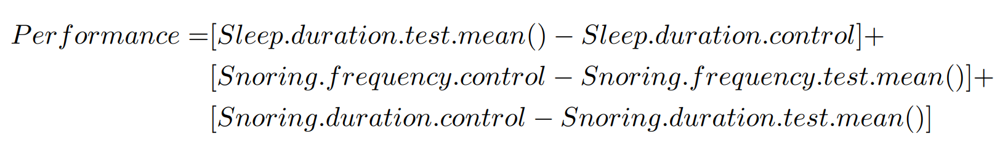    
[Note that sleep duration and snoring symptoms have opposite signs.]

According to the price-performance chart shown in Figure 7, we can see that the Nose Sticker and Anti-Snoring Pillow are more cost-effective.Due to the high price of the ventilator, we did not include it in the graph for comparison, as that would have unintuitive effects. Although the improvement effect of the ventilator is obvious, we will not show it in the price-performance graph.  

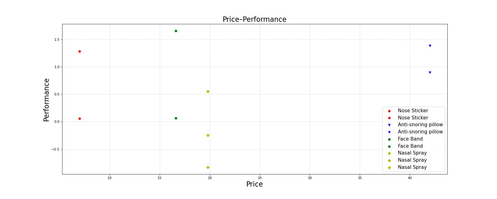  
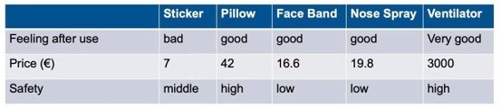         
[Figure 7]

## Feedback

* Face Band  
Advantages: The fabric has good air permeability and is not stuffy to wear. It can obviously inhibit breathing with your mouth open during sleep, without affecting sleep.   
Disadvantages: Fall off when sleeping. Strangulation, difficulty breathing.  
* Nose Spray  
Advantages: Snoring is reduced. Sleep quality is improved. Nose is immediately ventilated, and breathing is much smoother.  
Disadvantages: Snoring still exists at night, and the effect varies from person to person.  
* Nose Sticker  
Advantages: It helps opening the nostrils in simple physical way and making nosal breathing easier. Sticky, so its not easy to fall off.  
Disadvantages: The Strips tends to be flattened when sleeping, so the effect becomes worse. Some norstril discomfort at the beginning. People who are allergic to the strips/tape cannot use it.  

## Team
* Huiyu Wang(Group Leader)  
Collected and analyzed data on snoring population with anti-snoring devices
Provided transparent and objective recommendations for the selection of devices
* Yiyi Yao  
Designed the experimental procedure
wrote documentation  
* Yichu Chen  
Tested devices and organized tests  
Made video  
Videos Link: [Overview of "Stop Snoring" devices](https://www.youtube.com/watch?v=fkBrQGWJPI8)

## Copyright
* [1][Clinical Applications of Computational Medicine](https://www.ce.cit.tum.de/ldv/lehre/clinical-applications-of-computational-medicine/)
* [2][ISO 10993-1:2018(en) Biological evaluation of medical devices](https://www.iso.org/obp/ui#iso:std:iso:10993:-1:ed-5:v2:en)
* [3][Serra‐Torres S, Bellot‐Arcís C, Montiel‐Company J M, et al. Effectiveness of mandibular advancement appliances in treating obstructive sleep apnea syndrome: a systematic review[J]. The Laryngoscope, 2016, 126(2): 507-514.](https://onlinelibrary.wiley.com/doi/abs/10.1002/lary.25505)